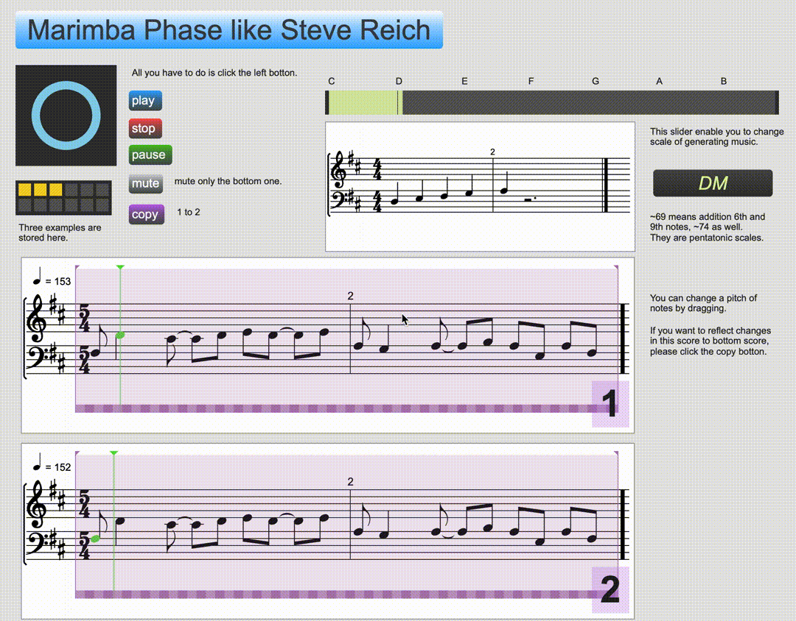

# Marimba Phase like Steve Reich

# Overview
Steve Reich氏の代表曲Piano Phaseをモチーフにした音楽の自動生成プログラム。  
  

# Description
ミニマルミュージックの代表的な作曲者Steve Reich氏の代表曲Piano Phaseをモチーフにした音楽を自動生成します。  
Piano Phaseでは2台のピアノが同じ短いフレーズを少しだけちがうテンポで演奏します。2台のピアノのフレーズが周期のずれからだんだんとずれていき、長い時間をかけてまたフレーズが重なり合う、という楽曲です。  
本作も同様のことを Marimba で行います。  

# Demo
[sample1[mp3]](http://kazunorisakai.com/music/demo1.mp3)  
[sample2[mp3]](http://kazunorisakai.com/music/demo2.mp3)  
本作では長い時間をかけてフレーズがずれていき、また重なり合う様子を楽譜の映像でも表現しています。ぜひダウンロードしてご鑑賞ください。

# Usage
[Max](https://www.mi7.co.jp/products/cycling74/)のダウンロードをしてください。  
[bach project](https://www.bachproject.net/)のパッチを多数使用しているため事前にインストールが必要です。  
[公式ダウンロード](https://www.bachproject.net/dl/)を参考にインストールしてください。  
左上のボタンで旋律の生成&再生が行われます。第一奏者が4回のループすると第二奏者の演奏が始まります。  
`mute`ボタンでで第二奏者の演奏だけ消音することも可能です。  
メロディは編集可能で、楽譜上で音符の音程を変更でき、右上のスライダーで生成する旋律のスケールの変更も可能です。  
`copy`ボタンで第一奏者の楽譜を第二奏者の楽譜にコピーが可能です。  
楽譜は`preset`(生成ボタンの下)で保存が可能です。初めから3つほど保存していますので聴いてみてください。  
楽譜はマウスで編集可能です。音符ごとに音程の変更や、ループ範囲の変更が可能です。また右上のスライダーでスケールの変更が可能です。  
